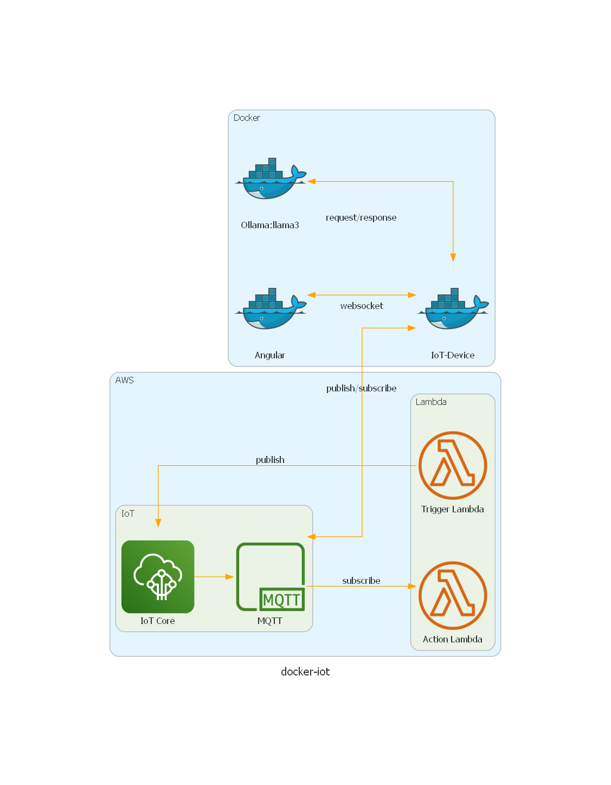

# Docker IoT Thing



[EC2 IoT Tutorial Used](https://docs.aws.amazon.com/iot/latest/developerguide/creating-a-virtual-thing.html)  
[Docker Networking](https://www.tutorialworks.com/container-networking/)

## Basic Setup
This project requires (Docker Desktop)[https://www.docker.com/products/docker-desktop/]  
On Windows, you'll also need to run it it Ubuntu WSL2 because all the scripts are bash scripts.  

## Security goodness
Save the necessary certificate and keys in a folder outside of this solution.  
The default locations in the scripts is **~/certs**  
```
mkdir ~/certs
```
Create a self-signed certificate for the nginx docker  
```
openssl req -x509 -newkey rsa:4096 -keyout ~/certs/static-key.pem -out ~/certs/static-cert.pem -sha256 -days 3650 -nodes -subj "/C=ZA/ST=Western Cape/L=Cape Town/O=RobotMaker/OU=R&D/CN=Jebear76"
```

Create a deployment account in AWS and attach the (iot deployment policy)[./deployment-policies/iot-device-deployment-policy.json] to it.  
Create an aws cli profile called **iot-user** with the appropriate access keys. This profile is used in (configure-iot-device.sh)[./configure-iot-device.sh]

Create a second deployment account in AWS and attach the (lambda deployment policy)[./deployment-policies/lambda-deployment-policy.json] to your deployment account.  
Create an aws cli profile called **iot-backend-deployment-user** with the appropriate access keys.This profile is used in (publish-lambda.sh)[./publish-lambda.sh]  

_You can also opt for a single deployment account if you wish, by attaching both policies to the same account_  
_The default region on all scripts is **eu-west-1**_

## AWS IoT Device Setup
```
. ./configure-iot-device.sh
```
## AWS Lambda Functions Setup
```
. ./publish-lambda.sh
```
## Docker setup
```
docker network create tulip-net
. ./run-docker.sh
```
